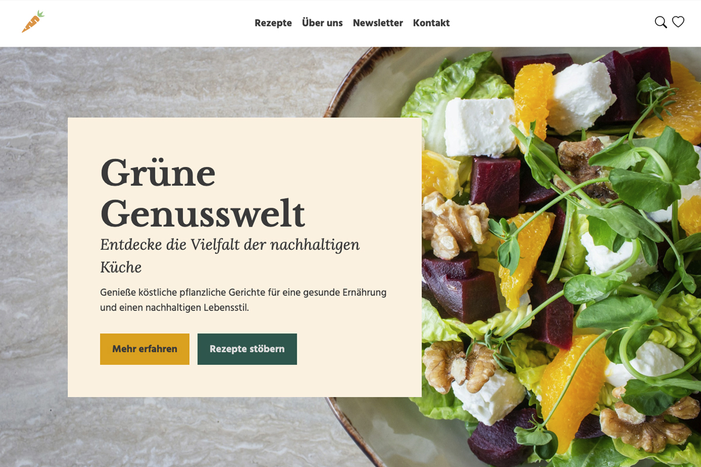
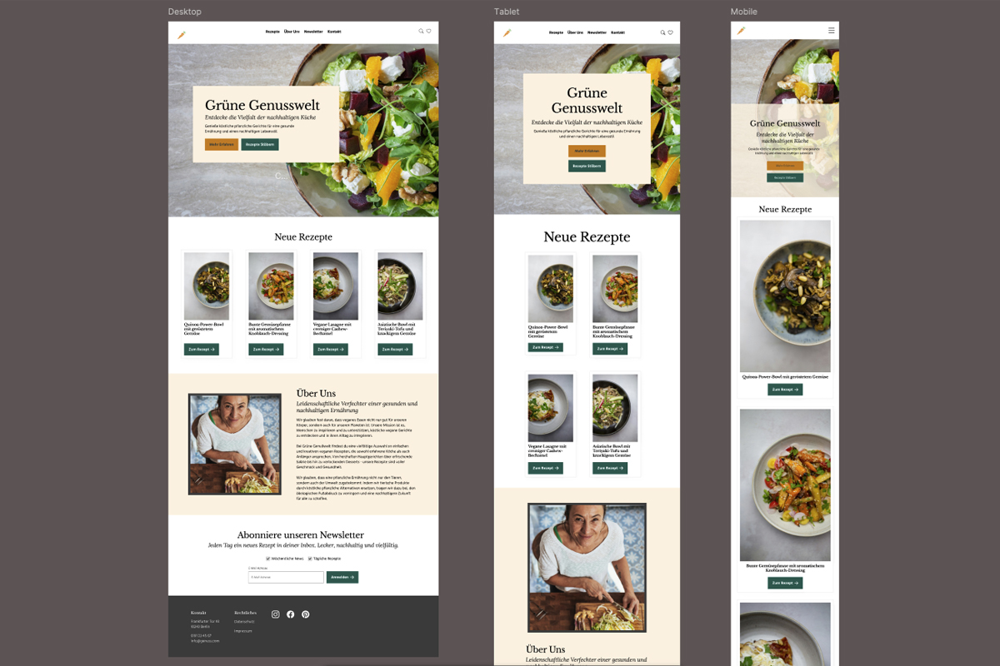

# Grüne Genusswelt 

Eine moderne, responsive Website für vegane Rezepte mit Fokus auf nachhaltige Ernährung und gesunden Lebensstil.

## Über das Projekt

Grüne Genusswelt ist eine einladende Webseite, die pflanzliche Rezepte präsentiert und Nutzer für eine nachhaltige Ernährung begeistert. Das Projekt wurde im Rahmen eines Webentwicklungs-Kurses bei karriere tutor erstellt.

<p align="center">
   
  
</p>

[](https://dontdevpanic.github.io/gruene-genusswelt/)

## Features

- **Responsive Design**: Optimiert für Desktop, Tablet und Mobile
- **Moderne Navigation**: Mit mobilem Overlay-Menü (Hamburger-Menü)
- **Rezeptkarten**: Übersichtliche Darstellung neuer veganer Rezepte
- **Newsletter-Anmeldung**: Integration eines Anmeldeformulars
- **Über-Uns-Sektion**: Vorstellung der Mission und Philosophie
- **Accessibility**: Fokus-States und semantisches HTML

## Technologien

- HTML5
- CSS3 (mit Custom Properties)
- Vanilla JavaScript
- Bootstrap Icons
- Custom Webfonts (Hind Madurai, Libre Baskerville, Lora)

## Projektstruktur

```
gruene-genusswelt/
├── index.html
├── assets/
│   ├── css/
│   │   ├── fonts.css
│   │   ├── variables.css
│   │   ├── style.css
│   │   └── sections.css
│   ├── fonts/
│   └── images/
├── noupload/
└── README.md
```

## Responsive Breakpoints

- **Desktop**: > 992px
- **Tablet**: 576px - 992px
- **Mobile**: < 576px

## Design-System

Das Projekt nutzt CSS Custom Properties für ein konsistentes Design:

- **Primary Color**: `#116156` (Dunkelgrün)
- **Secondary Color**: `#EDAA05` (Orange/Gold)
- **Base Color**: `#FFF3E3` (Helles Beige)
- **Light**: `#E0E0E0` (Hellgrau)
- **Dark**: `#424242` (Dunkelgrau)

## Credits

**Umsetzung:** Bianca Schlich  
**Design:** Figma-Template von Christine Hogg aus dem karriere tutor HTML & CSS Kurs  
**Entwicklung:** HTML und CSS Bianca Schlich  
**Beutreutes Coden:** JavaScript (nicht Teil des Kurses)

## Lizenz

Dieses Projekt ist für Bildungszwecke erstellt worden.

*Hinweis: Die Rezeptinhalte und Bilder dienen zu Demonstrationszwecken.*

## Andere Projekte

SChau dir mehr von [Bianca | DontDevPanic](https://github.com/dontdevpanic) an: 

- [HTML Code Escaper](https://github.com/dontdevpanic/html-code-escaper) - HTML-Code auf Websites anzeigen
- [HTML Entity Enconder](https://github.com/dontdevpanic/html-code-escaper) - Web-Tool zum Umwandeln von Text in HTML-Entities und zurück


